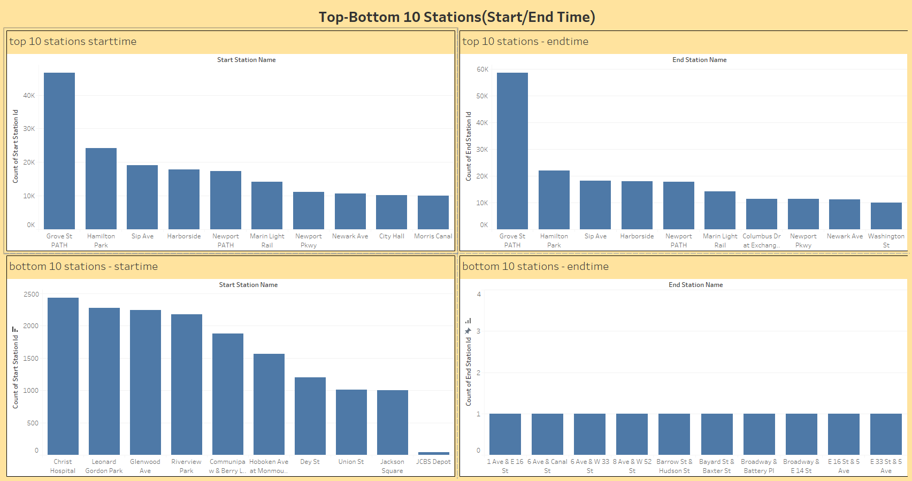
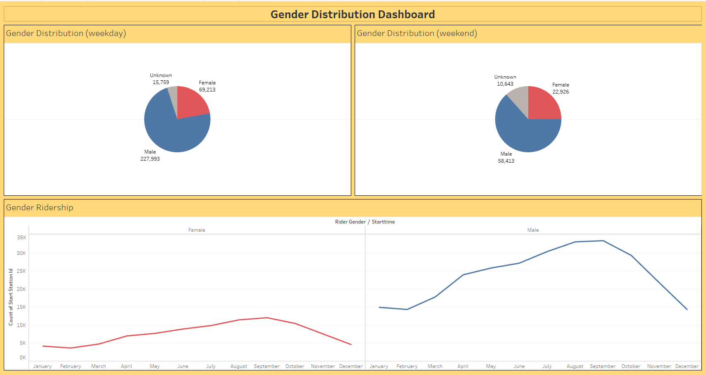
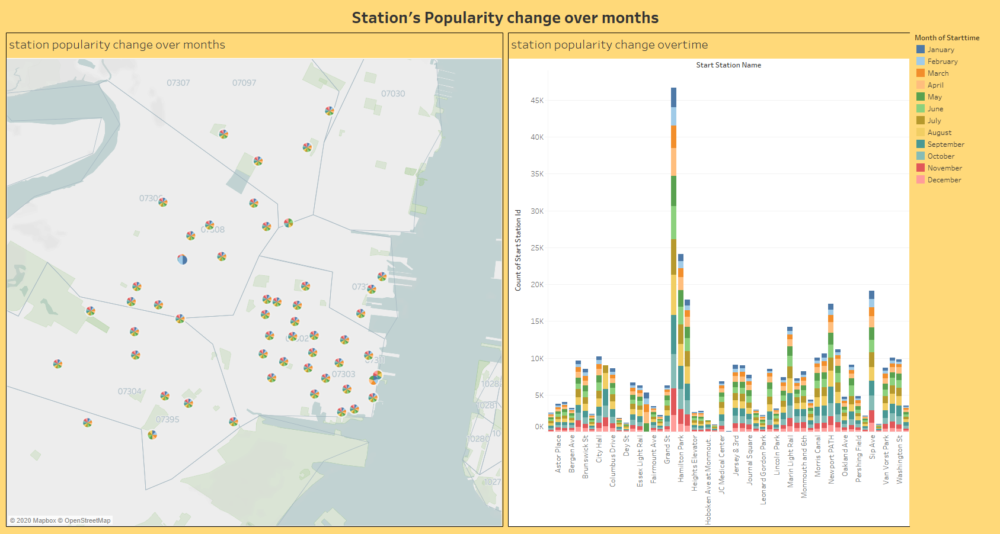

# CitiBike-2019 Analytics Project

The Citi Bike Program has implemented a robust infrastructure for collecting data on the program's utilization. Through the team's efforts, each month bike data is collected, organized, and made public on the Citi Bike Data webpage.

A analysis for the New York Citi Bike Program for the year 2019, in which will visualize 
the data insights to the city officials with the goal of acheiving better decisions faster.
 
* Click [here](https://public.tableau.com/profile/ahmed2691#!/vizhome/citibike_2019_project/stationpopularitychangeovertime?publish=yes) to view the Tableau Public workbook

.PNG)

.PNG)

## Data Source

the trip data for the year 2019 have been downloaded [Unprocessed Data](SourceData)
the data has been concatinated and wrangled using python [Jupyter Notebook](citibike_tripdata_2019.ipynb)

## Tableau Workbook

the final tableau workbook [.twbx](citibike_2019_project.twbx) which includes: 

  4-10 Total "Phenomenon" Visualizations
  
  2 Dashboards
  
  1 City Official Map
  
  1 Story
